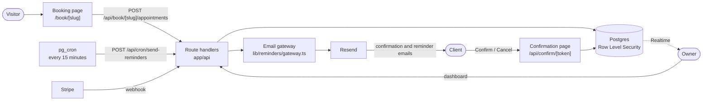

<div align="center">
  
  <p><strong>Online booking and email reminders for appointment-based businesses</strong></p>
  <p><a href="https://noshowly.vercel.app">noshowly.vercel.app</a></p>
</div>

<p align="center">
  <a href="https://github.com/AndreasVas04/noshowly/actions/workflows/ci.yml"></a>
  <a href="https://github.com/AndreasVas04/noshowly/actions/workflows/db-tests.yml"></a>
</p>

Noshowly is a booking and reminder service for businesses that live on
appointments, such as barbers and salons. Clients book on the business's own
booking page. Every booking gets a confirmation email and, a day before, a
reminder with Confirm and Cancel buttons. Answers appear on the owner's
dashboard as they arrive, so a cancellation is known a day ahead instead of
turning into an empty chair.

## Demo account

Sign in at [noshowly.vercel.app/login](https://noshowly.vercel.app/login):

- **Email:** demo@noshowly.com
- **Password:** Demo1234!

The account has sample staff, services and bookings. It is shared, so its
email and password cannot be changed, it cannot be deleted or subscribed, and
the emails it triggers go to its own address rather than to clients.

## Features

- **Public booking page** at `/book/<slug>` with the business's own title and
  introduction. Visitors choose a staff member (or any available one), a
  service, a date and a time, and can add the appointment to their calendar
  (.ics). Only times that fit the staff member's hours and breaks, the opening
  hours, existing appointments, a 30-minute minimum notice and a 90-day window
  are offered, and the server applies the same rules (`lib/availability.ts`)
  when it accepts the booking.
- **Emails** through Resend: a booking confirmation straight away and a
  reminder 24 hours before the appointment, with Confirm and Cancel buttons.
  The owner can edit the subject, greeting, body, closing and footer (with
  placeholders such as `{client_name}` and `{time}`) and send a test email.
- **Confirmation page:** the email buttons open a page that shows the
  appointment. Only pressing Confirm or Cancel on it changes anything, so link
  scanners in mail clients cannot.
- **Dashboard:** today's appointments with confirmed, pending and cancelled
  counts, a week view with a staff filter, and a form to add, edit or cancel
  appointments. Changes appear live through Supabase Realtime.
- **No double booking:** a staff member or a client cannot be booked twice at
  the same time. The API checks it with each appointment's real length, and a
  database constraint guarantees it for staff.
- **Clients** are found by name or phone while booking and reused instead of
  duplicated; their details can be edited from any of their appointments.
- **Staff and services:** staff with photo, bio and weekly hours with breaks;
  services with duration and price, overridable per staff member.
- **Time zones:** every date and time is in the business's time zone, whatever
  time zone the owner's or the client's browser uses.
- **Billing:** a 14-day free trial without a card, then the Basic plan through
  Stripe Checkout, managed in the Stripe customer portal.

## Architecture



- **Next.js on Vercel.** `proxy.ts` refreshes the Supabase session on every
  request and sends signed-out visitors from `/dashboard` and `/pricing` to
  the login page.
- **Booking page.** The page is rendered on the server, which reads the
  salon, staff, services and hours with the service-role key. In the browser,
  `BookingFlow` loads the busy times of a date from `GET /api/book/[slug]` and
  books with `POST /api/book/[slug]/appointments`.
- **Dashboard.** Client components call the route handlers under `app/api`.
  Each one checks the session with `requireUser()` and reads and writes the
  owner's data with the owner's session, so Row Level Security applies. The
  service-role key is only used for what owners may not do themselves, such
  as the billing fields, recording emails and storing staff photos.
- **Emails.** Every email goes through one gateway, which checks the plan,
  the monthly allowance and the sending limits, and records the email in the
  `reminders` table before sending it.
- **Billing.** The Stripe webhook keeps `users.plan` in step with the
  customer's subscriptions.

## Tech stack

| Area | Choice |
|---|---|
| Framework | Next.js 16 (App Router), React 19, TypeScript |
| UI | Tailwind CSS v4, shadcn/ui on Base UI, Framer Motion |
| Database and auth | Supabase: Postgres with Row Level Security, Auth, Realtime, Storage, pg_cron, Vault |
| Email | Resend |
| Payments | Stripe Checkout, customer portal and webhooks |
| Quality | Vitest, SQL tests on PostgreSQL 16, ESLint, knip, GitHub Actions, Dependabot |
| Hosting | Vercel |

## Security model

- **Row Level Security is the security boundary.** Every table has RLS. The
  owner policies apply to signed-in users and limit every row to the owner's
  own salon. The dashboard's route handlers query with the owner's session,
  so the same policies apply to them. Owners cannot write their own `users`
  row, which holds the plan, the trial end and the Stripe customer.
- **Read-only accounts are enforced in the database too.** When a trial has
  ended or a subscription is inactive, the API refuses writes, and
  `public.owner_has_write_access()` applies the same rule in the owner
  policies, so the public API cannot be used to get around it
  (`20260929120000_read_only_accounts.sql`).
- **The anon key reads nothing.** Signed-out requests can read no rows and
  write nothing (`20260928140000_private_booking_reads.sql`); the booking page
  and the confirmation links are served by the server.
- **The service-role key stays on the server.** `lib/supabase/admin.ts`
  imports `server-only`, so a client component cannot import it. Routes that
  act for a user call `requireUser()` first, which validates the session with
  Supabase Auth (`getUser()`, not the cookie alone), and only use the verified
  user id. Public routes first check what authorises them: the booking page
  slug (that booking page), the link token (one appointment), the cron secret
  (the reminder job) or the Stripe signature (the webhook).
- **The database enforces integrity:** CHECK constraints, foreign keys that
  cannot point into another salon, one salon per owner, unique booking page
  slugs and an exclusion constraint against overlapping appointments.
- **Email links** change nothing when opened. Confirming or cancelling is a
  POST from the page, applied only while the appointment is still pending,
  and a link stops working once the appointment has started or has been moved.
- **Abuse limits:** a honeypot field and a limit on repeated bookings from the
  same email or phone on the booking page, and per-salon, per-recipient and
  test-email limits on sending.
- **Demo account:** a database trigger blocks changes to its email and
  password, the API refuses to delete it or start billing for it, and its
  emails go to its own address.
- **HTTP headers:** `X-Content-Type-Options`, `Referrer-Policy`,
  `X-Frame-Options`, `Permissions-Policy` and `Strict-Transport-Security` on
  every response (`next.config.ts`). The confirmation page adds its own strict
  Content-Security-Policy and `Referrer-Policy: no-referrer`.

## Data model

| Table | Holds |
|---|---|
| `users` | One row per owner, next to `auth.users`: plan, trial end, Stripe customer, monthly email count. Written only by the server. |
| `salons` | The business: name, time zone, currency, opening hours, email templates. One per owner. |
| `barbers` | Staff members: name, photo, bio, active. |
| `services` | Service catalogue: name, duration, price, active. |
| `barber_services` | Which staff member performs which service, with optional price and duration overrides. |
| `staff_availability` | Weekly working hours and breaks of each staff member. |
| `clients` | The business's clients: name, phone, email, notes. |
| `appointments` | Client, staff member, service, start (UTC), length and status: `scheduled` (pending), `confirmed` or `cancelled`. |
| `reminders` | One row per email: type, status and the token of its Confirm and Cancel links. |
| `booking_pages` | The public page: slug, title, introduction, required contact fields, published or not. |

The schema lives in `supabase/migrations`; `supabase/README.md` describes each
migration and the order to apply them in.

## Reminders

| Email | When | Buttons |
|---|---|---|
| Booking confirmation (dashboard) | Right after the owner adds a pending appointment in the future | Confirm and Cancel |
| Booking confirmation (booking page) | Right after the client books | None: the client has just chosen the time |
| 24-hour reminder | Sent by the reminder job once a pending appointment starts within 24 hours. The job runs every 15 minutes, so reminders go out 24 hours to 23 hours 45 minutes ahead. It waits until 12 hours after a booking confirmation, so a client never gets both minutes apart. | Confirm and Cancel |
| Test email | When the owner presses "Send reminder" on an appointment | Shown, but they never change anything |

- An appointment made less than 23 hours ahead is saved as confirmed (unless
  the owner picks a status), since no reminder could ask in time.
- When the owner turns off "Request email confirmation" in Settings, emails
  are sent without buttons.
- A reminder that fails is retried by later runs, at most 3 times in 24 hours.
  An email the provider rejects as invalid is not retried; when the provider
  refuses the account itself (API key, sender domain, quota), the run stops
  and the reminders stay due for the next one. Overlapping runs never send the
  same reminder twice.

## Billing and trial

- Every new account starts a 14-day free trial (`users.trial_ends_at`) with
  full access and a small monthly email allowance. No card is needed.
- When the trial ends, or the subscription is no longer active, the account
  becomes read-only: everything stays visible and the business settings can
  still be saved, but staff, services, availability, clients, appointments and
  the booking page cannot be changed, no emails are sent and the booking page
  stops taking bookings. The rules are in `lib/entitlements.ts`; each route
  that changes data checks them with `requireWriteAccess()`.
- The Basic plan ($19 a month) is sold with Stripe Checkout, one subscription
  per customer, and is managed or cancelled in the Stripe customer portal
  (Settings, Billing, Manage billing).
- The webhook derives the plan from all of the customer's subscriptions every
  time, so the order of events and Stripe's retries do not matter. A
  `past_due` subscription keeps its plan while Stripe retries the payment.
  After Checkout, the dashboard also syncs the plan right away instead of
  waiting for the webhook.

## Testing

- **Unit tests** (Vitest, `npm test`) cover the logic in `lib/`: booking
  rules and time slots, time zone conversion, entitlements, subscription and
  plan sync, reminder rules, claims, quotas and templates, the confirmation
  page, contact validation, cron authentication, and account setup and
  deletion.
- **Database tests** (`scripts/test-db.sh`) build throwaway PostgreSQL
  databases from the migrations and run the SQL checks in `tests/db`: RLS for
  anonymous visitors and owners, tenant isolation, the service role,
  constraints, double booking, reminders, the demo account and the cron setup.
  They also apply every migration twice and run them over rows with the
  problems the live data can have.
- **CI:** `ci.yml` runs the type check, ESLint, the unit tests, knip, an audit
  of the production dependencies and a production build on every push and
  pull request. `db-tests.yml` runs the database tests against PostgreSQL 16.
  Dependabot proposes dependency updates.

## Local development

You need Node.js 22.12 or later (CI uses 22, Vercel 24), and for a local
database the Supabase CLI and Docker.

```bash
git clone https://github.com/AndreasVas04/noshowly.git
cd noshowly
npm ci
cp .env.example .env.local    # then fill it in; every variable is described there
```

Local database:

```bash
supabase init        # once, creates supabase/config.toml
supabase start       # Postgres, Auth, Storage and Realtime in Docker; prints the URL and keys
supabase db reset    # applies supabase/migrations
```

Put the URL, anon key and service-role key that `supabase start` prints in
`.env.local`, then run `npm run dev` and open http://localhost:3000. To work
against a hosted project instead, run `supabase link --project-ref <ref>` and
`supabase db push`.

To send the due reminders by hand, and to receive Stripe events locally:

```bash
curl -X POST http://localhost:3000/api/cron/send-reminders -H "X-Cron-Secret: <CRON_SECRET>"
stripe listen --forward-to localhost:3000/api/webhooks/stripe   # prints the STRIPE_WEBHOOK_SECRET to use
```

| Command | What it does |
|---|---|
| `npm run dev` | Development server |
| `npm run build`, `npm start` | Production build and server |
| `npm run typecheck` | TypeScript type check |
| `npm run lint` | ESLint with the Next.js core web vitals and TypeScript rules |
| `npm test` | Unit tests |
| `npm run knip` | Unused files, exports and dependencies |
| `npm run check` | Type check, lint, unit tests and knip |
| `scripts/test-db.sh` | Database tests; needs `psql` and PostgreSQL 15 or later (see `supabase/README.md`) |

## Deployment

1. **Vercel:** import the repository and set the variables from
   `.env.example`, with `NEXT_PUBLIC_APP_URL` set to the production URL.
   `NEXT_PUBLIC_` values are built into the bundle, so redeploy after changing
   them.
2. **Supabase:** apply the migrations in order (see `supabase/README.md`).
   Under Authentication, URL Configuration, set the site URL to the app's URL
   and allow redirects to it (for example `<app URL>/**`): email confirmation
   returns to `/auth/callback` and password reset to `/api/auth/callback`.
3. **Reminder job:** `20260609000100_platform_setup.sql` schedules a pg_cron
   job that calls `POST <app URL>/api/cron/send-reminders` every 15 minutes
   with an `X-Cron-Secret` header, reading both values from Vault. Create the
   two secrets, then run that migration again:

   ```sql
   SELECT vault.create_secret('https://your-app.example.com', 'app_url');
   SELECT vault.create_secret('<same value as CRON_SECRET>', 'cron_secret');
   ```

   The route also accepts `GET` with `Authorization: Bearer <CRON_SECRET>`,
   which is how Vercel Cron calls it.
4. **Stripe:** create the Basic plan's monthly price (`STRIPE_BASIC_PRICE_ID`).
   Add a webhook endpoint at `<app URL>/api/webhooks/stripe` for the events
   `checkout.session.completed`, `customer.subscription.created`,
   `customer.subscription.updated`, `customer.subscription.deleted`,
   `customer.subscription.paused`, `customer.subscription.resumed`,
   `invoice.paid`, `invoice.payment_succeeded` and `invoice.payment_failed`,
   and set its signing secret as `STRIPE_WEBHOOK_SECRET`. Turn on the customer
   portal with payment method updates, invoices and cancellation at the end of
   the billing period. Under failed payments, cancel the subscription or mark
   it unpaid after the last retry, so an unpaid account becomes read-only.

   Switching from test to live keys: Stripe customers stored while testing
   do not exist in live mode. The next checkout replaces such a customer and
   Manage billing forgets it, so nobody gets stuck. Plans set by test
   subscriptions are not changed, though (no live webhook will ever update
   them), so set those accounts back to `trial` or `cancelled` before going
   live.
5. **Resend:** verify a sending domain and set `RESEND_FROM_ADDRESS`, for
   example `reminders@yourdomain.com`. Emails show the business's name as the
   sender name. Without it, Resend's test sender only delivers to the address
   of your own Resend account.

## Project structure

```
app/
  api/                  route handlers: appointments, clients, staff, services,
                        booking, billing, reminder job, webhooks, email links
  book/[slug]/          public booking page (steps in _components/)
  dashboard/            today, week, booking page setup and settings
  auth/, login/,        sign-up, sign-in and password reset
  register/
  pricing/              plan and Stripe Checkout
components/             dashboard, landing page and shared UI components
  dashboard/            day and week views, and one folder per larger screen:
                        appointment-modal/, booking-settings/, settings/
lib/                    booking rules, time zones, entitlements, billing,
                        reminders, Supabase clients
  __tests__/            unit tests (more next to the components they cover)
proxy.ts                session refresh and route guards
supabase/migrations/    schema, RLS policies and the reminder job
tests/db/               database tests (scripts/test-db.sh)
types/                  database row types
.github/                CI, database tests and Dependabot
```

## License

This project is not open source. All rights reserved.

*Built as a portfolio project by Andreas Vasileiou.*
